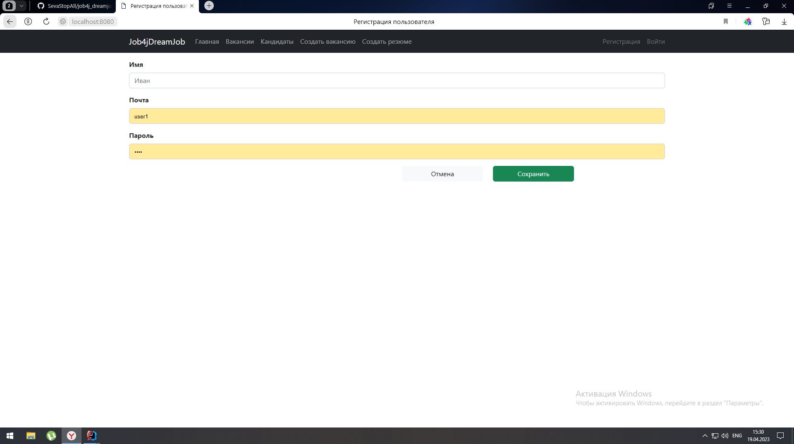
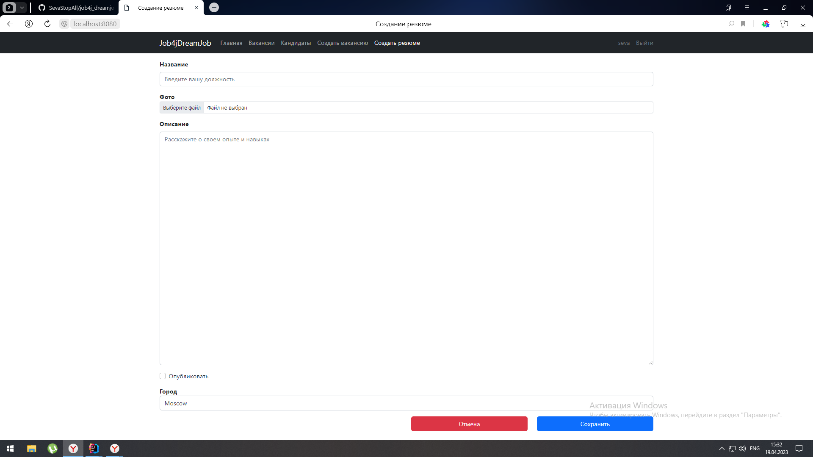

# job4j_dreamjob

## About

The main task is understanding web application architecture principles, imitating vacancies base. 

## Features:
### Регистрация на сайте и авторизация.

### Возможность создавать резюме и вакансии и их последующее редактирование. 

#### Stack:
- **Java 17**
- **Spring Boot 2.7.10**
- **PostgreSQL 14 + Sql2o**

#### Requirements:
- **Java 17**
- **Maven 3.8**
- **PostgresSQL 14**

### Launch.
Запустите файл Main.java in job4j_cars/src/main/java/job4j_dreamjob

